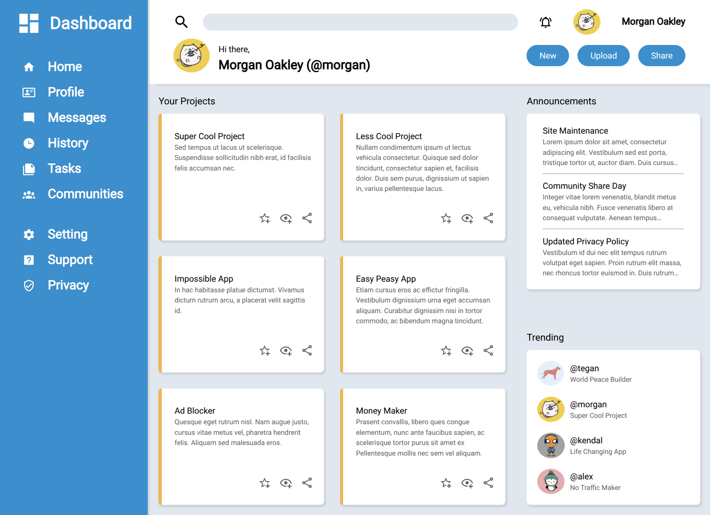

# Project: Admin Dashboard

This is my implementation of the
[Project: Admin Dashboard](https://www.theodinproject.com/lessons/node-path-intermediate-html-and-css-admin-dashboard)
from the Intermediate HTML and CSS Course from The Odin Project.

Checkout the [live preview here](https://peter-mowen.github.io/odin-admin-dashboard/).

The goal of this project was to recreate the following design:

The requirements said not to worry about making this project responsive, so it
was not tested on mobile.

My submission looks likes this:

